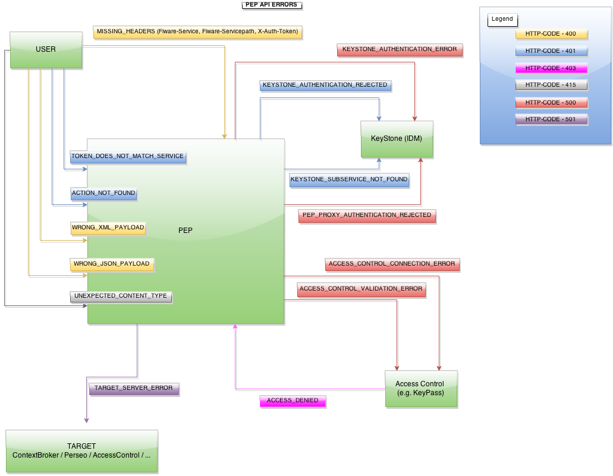

# API Error codes

This document shows the list of error codes that can be returned from the API, along with their HTTP Codes.

| Name | Code | Description |
|:---------------- |:--------------|:----------------------|
|MISSING_HEADERS|400|Some headers were missing from the request: %s|
|TOKEN_DOES_NOT_MATCH_SERVICE|401|The provided token does not belong to the provided service.|
|ACTION_NOT_FOUND|400|The system wasn't able to guess the action type or the request|
|WRONG_XML_PAYLOAD|400|The system wasn't able to parse the given XML payload|
|WRONG_JSON_PAYLOAD|400|The system wasn't able to parse the given JSON payload (either it was empty or wrong)|
|ACCESS_CONTROL_CONNECTION_ERROR|500|There was a connection error accessing the Access Control: %s|
|ACCESS_CONTROL_VALIDATION_ERROR|500|The Access Control failed to make a decision due to the following error: %s|
|KEYSTONE_AUTHENTICATION_ERROR|500|There was a connection error while authenticating to Keystone: %s|
|KEYSTONE_AUTHENTICATION_REJECTED|401|User authentication was rejected with code: %s|
|KEYSTONE_SUBSERVICE_NOT_FOUND|401|Could not find subservice with name [%s] in Keystone.|
|PEP_PROXY_AUTHENTICATION_REJECTED|500|Proxy authentication was rejected with code: %s|
|ROLES_NOT_FOUND|401|No roles were found for the user token in the give subservice: %s|
|ACCESS_DENIED|403|The user does not have the appropriate permissions to access the selected action|
|UNEXPECTED_CONTENT_TYPE|415|The MIME content type received is not supported: %s|
|TARGET_SERVER_ERROR|501|There was an error redirecting the request to the target server: %s|
|USER_NOT_FOUND|400|User credentials not found|

Here there is a diagram with the errors returned by PEP. Each color represent the error and is indicated when is raised in the flow of a request

